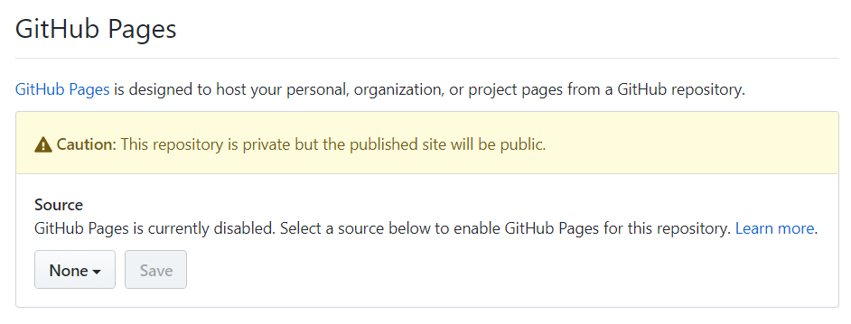
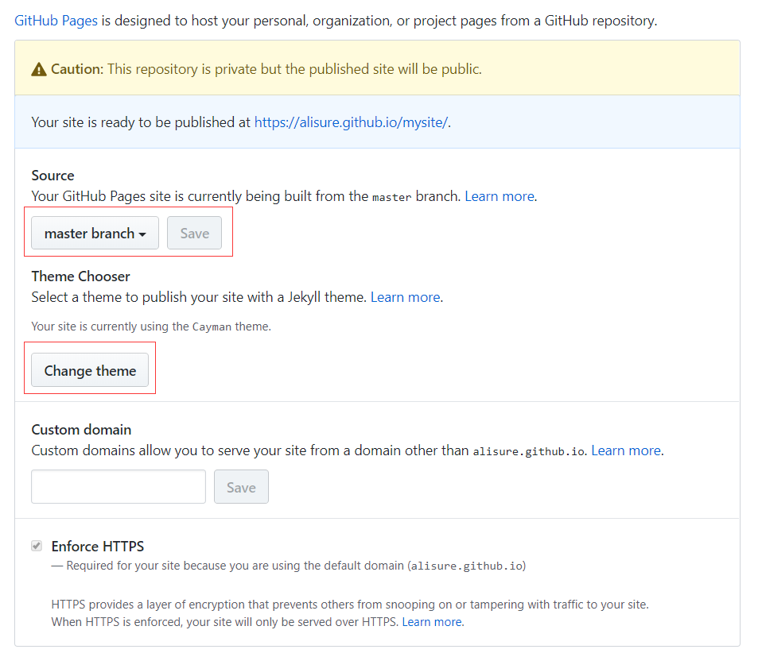

# mysite

### 模板中选择

* 新建项目

* 创建Master分支或者其他分支

* 在settings中GitHub Pages下选择Source所在分支（刚才创建的分支）

* 在settings中GitHub Pages下点击Change theme选择模板中的主题

* 访问[https://alisure.github.io/mysite/](https://alisure.github.io/mysite/)

### 静态站点目录

> 此时访问`docs/`下的站点

* 新建目录 `docs/`

* 在settings中GitHub Pages下选择Source为`master branch /docs folder`

* 访问[https://alisure.github.io/mysite/](https://alisure.github.io/mysite/)
